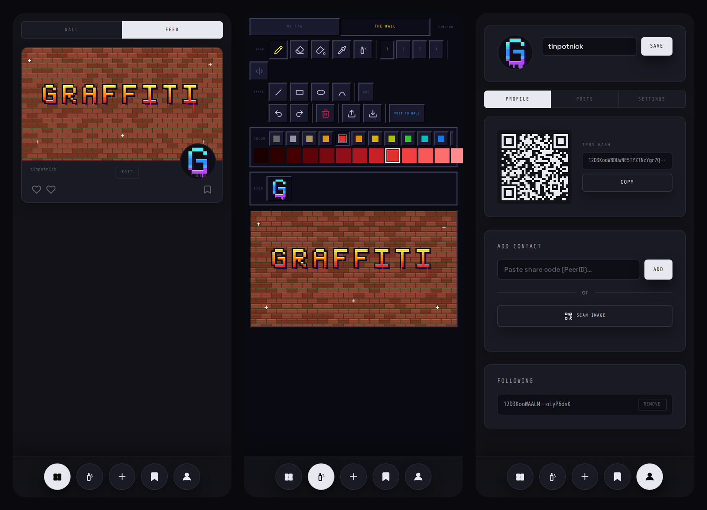

# graffiti

**An experiment: can a decentralised file system be the engine for a social network?**

graffiti is a pixel-art social app built on [IPFS](https://ipfs.tech/) to find out. You draw on your wall, tag other people's walls, and follow your friends. There's no server, no database and no accounts: just content-addressed files, keypairs, and whatever the network can do with them.

[](https://github.com/tinpotnick/graffiti/actions/workflows/ci.yml)
[](LICENSE)




## The experiment

Social networks are usually a database owned by someone. IPFS offers something different: immutable, content-addressed files that anyone can host, plus IPNS, a mutable pointer that only the holder of a private key can update. graffiti asks how far you can get building a social network from just those two primitives.

It's a **thought experiment that happens to run**, not a product. It works well enough to use and to learn from, but the interesting part is the set of problems it exposes. A graffiti wall turns out to be a good test bed, because walls are shared, public and constantly written over by people who don't own them.

### Ideas it explores

- **Writing on someone else's wall without write access.** Only you can update your IPNS name, so nobody can add to your wall directly. Instead, a tagger publishes just their *delta*, in their own space, with a pointer (`wallRef`) to your wall's CID. Each viewer's app composites every tag it can find on top of the original. The result is that a wall has no single canonical state: what you see depends on who you follow.
- **Identity is a keypair.** Your PeerID is both your identity and your address. There's no sign-up, and no one can revoke it.
- **Engagement as replication.** Bookmarking or really-liking a post pins it, so popular content ends up hosted by the people who value it, like a CDN driven by demand.
- **Small, cheap updates.** Posts, likes and bookmarks are bucketed by month behind a ~1KB root manifest. A single like republishes one bucket, not your whole history.
- **Discovery through the social graph.** Your follows' likes and bookmarks surface people you don't follow yet.

### Open problems

These are unsolved, and they're what make this interesting. Ideas and discussion are just as welcome as code.

- **Ease of setup.** Content only stays online if it's pinned, which today means signing up for a pinning service and pasting in a JWT. That's a big ask for a social app.
- **Speed.** Resolving IPNS names from a browser node can take seconds to minutes, and every wall means resolving everyone you follow.
- **Availability.** IPNS records expire if you're offline for a couple of days, and browser nodes struggle with NAT traversal and the DHT.
- **Moderation and consent.** You can't remove a tag from your own wall, because it lives in someone else's space. Viewers only see tags from people they follow, but is that enough?
- **Deletion.** Content addressing means that once something is replicated, "delete" really means "stop pointing at it".
- **Notifications.** How does a wall owner find out they've been tagged by someone they don't follow?
- **Format stability.** The data model is still changing, and there's no migration story yet.

See **[IPFS.md](IPFS.md)** for the architecture in depth, the non-standard choices, and notes on self-hosting a pinning node.

## What you can do

- **MY TAG**: a 64×64 pixel avatar that is your signature
- **THE WALL**: a 320×180 canvas with a 256-colour palette, spray can, shapes, mirror mode and PNG import/export
- **Tag other walls**: draw over someone else's piece, and your delta is composited on top
- **Text posts**: a markdown editor with drafts
- **Like, really-like and bookmark**
- **Follow by QR code or PeerID**
- **Desktop and Android** via [Tauri 2](https://tauri.app/)

## How it works

Every user runs an in-browser IPFS node ([Helia](https://github.com/ipfs/helia)). Your node's Ed25519 keypair is your identity, and its PeerID doubles as your IPNS name. That name always points at a small JSON manifest, which links to your tag, monthly buckets of posts, likes and bookmarks, and the people you follow:

```
IPNS name (PeerID)
  └─► root manifest (JSON, ~1KB)
        ├── tag:       "<CID>"                   ← 64×64 avatar PNG
        ├── posts:     { "2026-03": "<CID>", … }  ← monthly post buckets
        ├── likes:     { "2026-03": "<CID>", … }
        ├── bookmarks: { "2026-03": "<CID>", … }
        ├── following: ["<PeerID>", …]
        └── displayName, updatedAt, version: 2
```

Content is stored locally in IndexedDB and optionally pinned to a remote service ([Pinata](https://www.pinata.cloud/) today), so it stays reachable when your device is offline. Reads fall back to public IPFS gateways. [IPFS.md](IPFS.md) has the details.

## Quick start

The only requirement is Docker with Docker Compose. You don't need Node, pnpm or Rust on your machine.

```sh
git clone https://github.com/tinpotnick/graffiti.git
cd graffiti
docker compose up frontend-dev
```

Open <http://localhost:1420>. The whole app, including the IPFS node, runs in the browser.

## Development

| Task | Command |
|---|---|
| Dev server with hot reload | `docker compose up frontend-dev` |
| Type check | `docker compose run --rm frontend-check` |
| Production frontend build | `docker compose run --rm frontend-build` |
| Desktop app (Tauri window) | `./scripts/tauri-dev.sh` |
| Desktop release bundles | `./docker-build.sh` → `./dist-bundle/` |
| Android debug APK | `./scripts/android-build.sh` |
| Local Kubo node for inspecting CIDs | `docker compose up ipfs-dev` |

### Desktop app

`./scripts/tauri-dev.sh` starts the Vite server in Docker, compiles the Tauri binary in Docker, then runs it on your host, where the display is. You need one host library for this:

```sh
sudo dnf install webkit2gtk4.1          # Fedora
sudo apt install libwebkit2gtk-4.1-0    # Debian/Ubuntu
```

| Change | What to do | Speed |
|---|---|---|
| TypeScript / CSS | Nothing: Vite HMR picks it up | Instant |
| Rust source | Re-run `./scripts/tauri-dev.sh` | ~10 s (cached) |
| First ever build | Wait for crates to download and compile | Several minutes |

### Android

```sh
./scripts/android-build.sh
```

The APK lands in `src-tauri/gen/android/app/build/outputs/apk/`. The first build takes 15–30 minutes because it downloads the Android SDK/NDK inside Docker and cross-compiles Rust for four architectures. Later builds are cached.

### Troubleshooting

- **Dependencies look stale after editing `package.json`:** run `docker compose run --rm frontend-check`, which reinstalls.
- **Anything else odd:** do a clean reset of all Docker volumes with `docker compose down -v`.

## Project structure

```
src/
  main.ts                  entry point, theme handling
  shell/app-shell.ts       SPA router
  views/
    home-view.ts           wall + feed of everyone you follow
    paint-view.ts          pixel editor (MY TAG / THE WALL / tagging)
    create-view.ts         markdown post editor with drafts
    post-view.ts           single text post
    saved-view.ts          bookmarks
    account-view.ts        profile, QR sharing, following, settings
  components/
    paint-canvas.ts        256-colour pixel engine
    wall-scroll.ts         composited wall view
    feed-item.ts           post card
    md-editor.ts           Tiptap markdown editor
    top-nav.ts             bottom navigation
  services/
    ipfs.ts                Helia node: add/cat, IPNS publish/resolve, gateway fallback
    profile.ts             manifest, posts, likes, bookmarks, follows
    pinning.ts             Pinata remote pinning
    compositing.ts         wall + tag image compositing
src-tauri/                 Tauri shell (Rust) and generated Android project
scripts/                   Docker-based dev/build helpers
```

## Stack

| Layer | Tech |
|---|---|
| UI | Vanilla TypeScript + Web Components |
| IPFS | [Helia](https://github.com/ipfs/helia), IPNS over DHT + GossipSub |
| Pinning | [Pinata](https://www.pinata.cloud/) (pluggable, see [IPFS.md](IPFS.md)) |
| Editor | [Tiptap v3](https://tiptap.dev/) |
| App shell | [Tauri 2](https://tauri.app/) (desktop + Android) |
| Build | Vite 6, all in Docker |

## Contributing

Contributions of all sizes are welcome: bug reports, ideas for the open problems above, pixel art, docs and code. Start with [CONTRIBUTING.md](CONTRIBUTING.md), and please follow our [Code of Conduct](CODE_OF_CONDUCT.md). To report a security issue, see [SECURITY.md](SECURITY.md).

## License

[MIT](LICENSE) © Nick Knight
